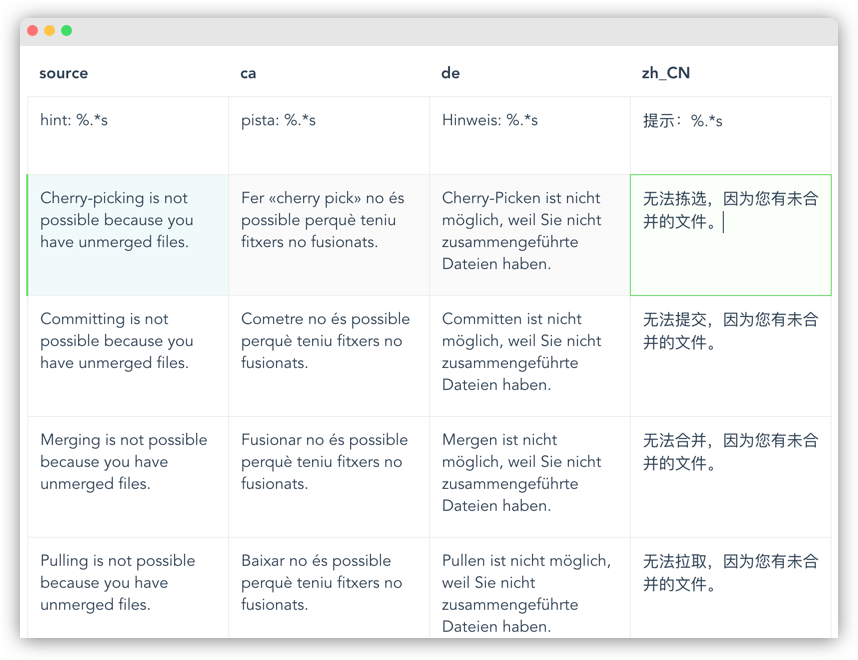

# simple-trans

Simple, JSON-based web app to ease translation of software projects



## Why?

- While there is a number of localisation platforms available, some companies prefer to not host their project content on third party servers if possible.
- For a development process where quick iteration is important, an online approach as a single and unidirectional "source of truth" is much preferable to a file-based workflow.
- All language translations are visible at a glance, which can be helpful for translators and can facilitate coherence across languages.
- Simplicity.

## How?

Create project-specific directories inside `static/l10n` to host your JSON translation files. Inside the JSON files the keys correspond to the source strings and need to exist beforehand, but their corresponding values can be filled through the web app. See the `sample-project` directory as an example.

## Build Setup

``` bash
# install dependencies
npm install

# serve with hot reload at localhost:8080
npm run dev

# build for production with minification
npm run build

# build for production and view the bundle analyzer report
npm run build --report

# run unit tests
npm run unit

# run e2e tests
npm run e2e

# run all tests
npm test
```

For detailed explanation on how things work, checkout the [guide](http://vuejs-templates.github.io/webpack/) and [docs for vue-loader](http://vuejs.github.io/vue-loader).
